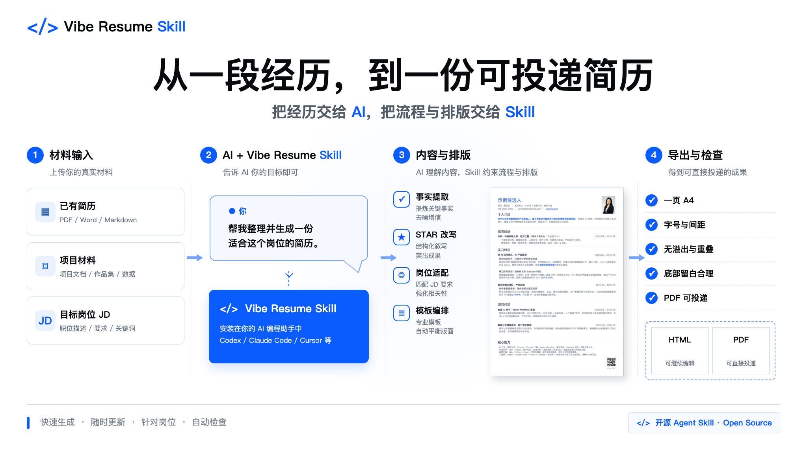
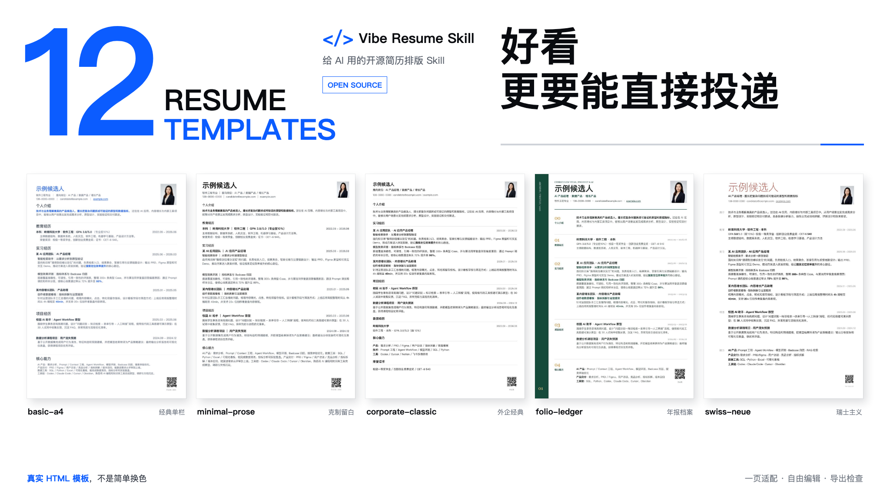
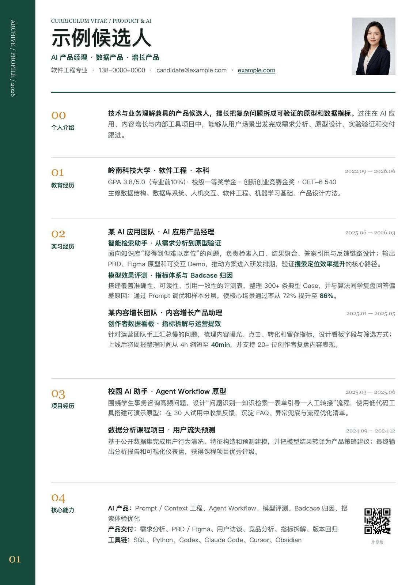
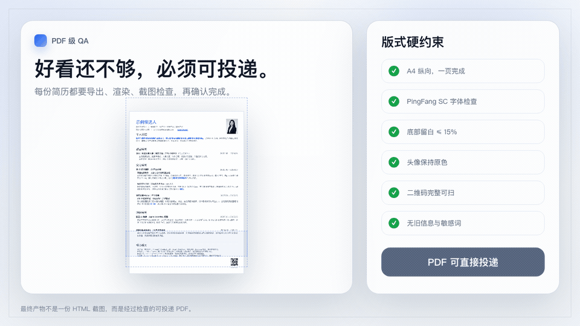

# vibe-resume-skill

**快速生成精美简历，快速更新和编排内容，把时间留给经历本身，而不是字号、间距和分页。**

[](LICENSE)
[](assets/templates/basic-a4/resume.html)
[](SKILL.md)

`vibe-resume-skill` 是一套给 AI 编程助手使用的简历 Skill。把你的经历、现有简历或目标岗位交给它，就能生成一份排版完整的简历；后续新增经历、替换内容或调整投递方向，也可以直接通过对话完成。

Skill 内置 12 套 A4 模板，并把一页排版、内容密度、头像、二维码和最终检查等要求写进了规则。你只需要说明想改什么，剩下的编辑与排版交给 AI。



## 适用场景

1. **从零整理一份新简历**

   经历分散在项目文档、实习总结或作品集中，还没有形成完整简历。把材料和目标岗位交给 AI，它会先整理事实，再生成一页版本。

   `根据这些材料整理一份 AI 产品简历，先确认事实，再使用 basic-a4 输出 HTML 和 PDF。`

2. **更新一份已经排好的简历**

   已经有满意的 PPT、PDF、Word 或 HTML 简历，但新增一段经历后，原来的分页、间距和对齐很容易被打乱。Skill 会尽量复用现有视觉语言，插入或替换内容，再重新平衡整页版式。

   `保留当前模板，把这段实习加入实习经历；不要删减其他内容，重新检查一页排版。`

3. **针对不同岗位维护多个版本**

   同一段经历投递不同岗位时，事实不变，但顺序、标题、关键词和篇幅侧重需要调整。把 JD 一并提供，就可以生成对应版本。

   `基于这份 JD 调整为数据产品方向，保留原始事实，并单独导出一个版本。`

## 怎么用

第一步，把仓库地址发给你的 AI 编程助手：

```text
https://github.com/KevinYoung-Kw/vibe-resume-skill
```

第二步，让它安装 Skill：

```text
帮我安装这个 Skill，然后用它帮我写简历。
```

第三步，选择模板并提供材料。你可以上传已有简历，也可以直接发送一段经历。后续修改继续用自然语言说明即可：

```text
把这段实习加进去，保持原来的样式。
底部有些空，重新平衡一下排版。
针对这份 JD 调整为数据产品方向，再导出一版。
```

目前已在 Codex、Kimi Work、WorkBuddy 和扣子空间中实际测试。

## 12 套模板



### 实用系

优先考虑招聘阅读顺序、信息密度与正式投递场景。

<table>
<tr>
<td align="center"><br><b>basic-a4</b><br><sub>经典单栏 · ATS 友好</sub></td>
<td align="center"><br><b>editorial</b><br><sub>双栏 Grid · 字重层级</sub></td>
<td align="center"><br><b>sidebar-compact</b><br><sub>深色侧栏 · 高辨识度</sub></td>
<td align="center"><br><b>timeline-grid</b><br><sub>时间轴 · 成长叙事</sub></td>
</tr>
<tr>
<td align="center"><br><b>minimal-prose</b><br><sub>克制单栏 · 留白舒展</sub></td>
<td align="center"><br><b>corporate-classic</b><br><sub>外企经典 · 内容优先</sub></td>
<td align="center"><br><b>gov-red</b><br><sub>党政风 · 庄重规范</sub></td>
<td align="center"><br><b>folio-ledger</b><br><sub>年报档案 · 编号索引</sub></td>
</tr>
</table>

### 个性系

保留完整的设计语言，适合技术、设计与创意岗位。

<table>
<tr>
<td align="center"><br><b>mono-raw</b><br><sub>Brutalist · 等宽排版</sub></td>
<td align="center"><br><b>code-poetry</b><br><sub>源代码隐喻 · 极客风</sub></td>
<td align="center"><br><b>swiss-neue</b><br><sub>瑞士主义 · 隐形网格</sub></td>
<td align="center"><br><b>bauhaus</b><br><sub>包豪斯几何 · 三原色点缀</sub></td>
</tr>
</table>

模板不是简单换色。每套模板都有独立的信息结构、字号层级、间距节奏与适用场景。

## AI 会自动处理什么

- 根据经历和目标岗位整理内容，保留真实事实，不编造指标
- 区分教育、实习、项目与能力，避免经历放错位置
- 根据内容多少调整字号、行距与段落间距
- 尽量保持一页，并避免文字溢出、重叠或异常换行
- 保持头像原色，确保二维码清晰且不被遮挡
- 导出后检查整页效果，发现问题继续修改



## Star History

<a href="https://www.star-history.com/?repos=KevinYoung-Kw%2Fvibe-resume-skill&type=date&legend=top-left">
 <picture>
   <source media="(prefers-color-scheme: dark)" srcset="https://api.star-history.com/chart?repos=KevinYoung-Kw/vibe-resume-skill&type=date&theme=dark&legend=top-left&sealed_token=MGIwE7UOti3rlRQhmUe4-jfNj-wVj54h-tryO1DkXRbrtetNAtNq5028PtHQLc7VgTAMh8tTS_urWW5CDoxb7o7xEiKrKO0DFtbynQNZmqlwWU5ySWUKGeZjSn2JemO-5cIcYE1TthUw0ReUs-L75kyg7TNNdHXZI-9nTDPtBuVebQCK9EGsPcXiED8O" />
   <source media="(prefers-color-scheme: light)" srcset="https://api.star-history.com/chart?repos=KevinYoung-Kw/vibe-resume-skill&type=date&legend=top-left&sealed_token=MGIwE7UOti3rlRQhmUe4-jfNj-wVj54h-tryO1DkXRbrtetNAtNq5028PtHQLc7VgTAMh8tTS_urWW5CDoxb7o7xEiKrKO0DFtbynQNZmqlwWU5ySWUKGeZjSn2JemO-5cIcYE1TthUw0ReUs-L75kyg7TNNdHXZI-9nTDPtBuVebQCK9EGsPcXiED8O" />
   
 </picture>
</a>

## Contributing

欢迎提交 Issue、文档修正和模板建议。新模板需要经过完整预览与质量检查后才会加入。

## License

[CC BY-NC 4.0](LICENSE)。个人与非商业用途可按许可证使用；商业使用请联系作者。

---

<p align="center">
  
</p>

<p align="center">
  <b>水的离子积 × <a href="https://colaos.ai">Cola</a></b><br>
  <sub>Powered by Cola</sub>
</p>

<p align="center">
  <br>
  <sub>关注公众号「水的实践说」获取更多 AI 实践内容</sub>
</p>
