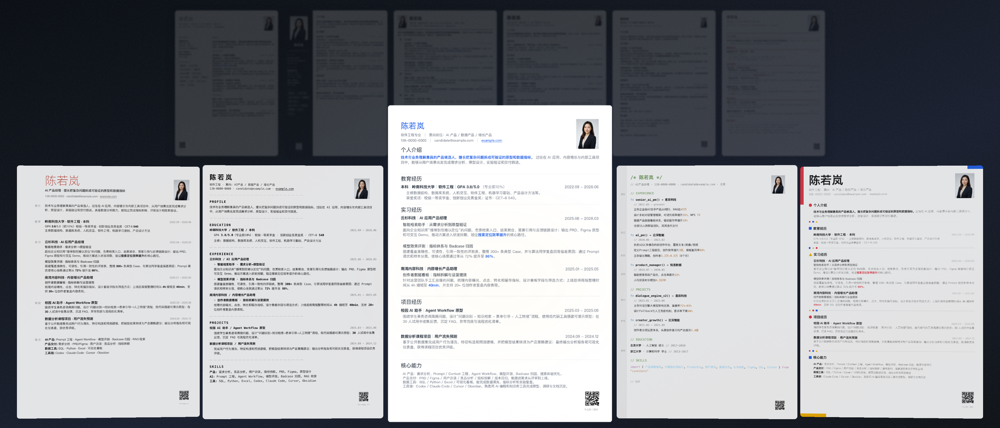

# vibe-resume-skill

**Stop formatting. Start vibing.**

用 Vibe Coding 的方式做简历:你只管说,AI 负责排版、适配、导出--全部。

11 套 A4 模板,纯 HTML/CSS,零依赖。这不是模板集,是给 AI 编程助手用的 **Skill 指令文件**。

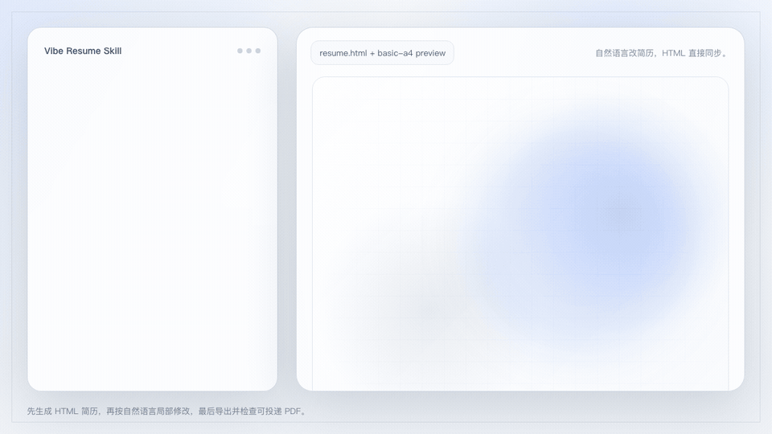

[](https://creativecommons.org/licenses/by-nc/4.0/)

---

## 🔥 30 秒理解这是什么

```
你:帮我用 swiss-neue 写简历,经历如下......
AI:✅ 生成 HTML + 导出 PDF(自动排版、密度适配、QA 通过)

你:底部太空了,内容排版再紧凑一些
AI:✅ 字号行高调大,重新导出

你:帮我改成数据产品方向,再出一版
AI:✅ 保留风格,重组内容侧重,新 PDF 已生成

你:这段实习加上去
AI:✅ 插入内容,自动适配间距
```

**你不碰排版。你不调间距。你不换字号。你只说人话。**

---

## 💡 为什么做这个

| 痛点 | 传统做法 | Vibe Resume |
|------|---------|-------------|
| 从 0 写简历 | 3 小时写内容,2 小时调排版 | 说几句话,AI 全搞定 |
| 改投不同 JD | 手动改 5 遍 | AI 根据 JD 批量生成 N 个版本 |
| 更新一段经历 | 打开 Word,调间距,改分页 | "加上这段",完事 |
| 想换风格 | 重新做一份 | "换成 mono-raw",3 秒切换 |

---

## 📋 11 套模板

### 实用系

适合直接投递的正式简历，设计克制、信息密度高、ATS 友好。

<table>
<tr>
<td align="center">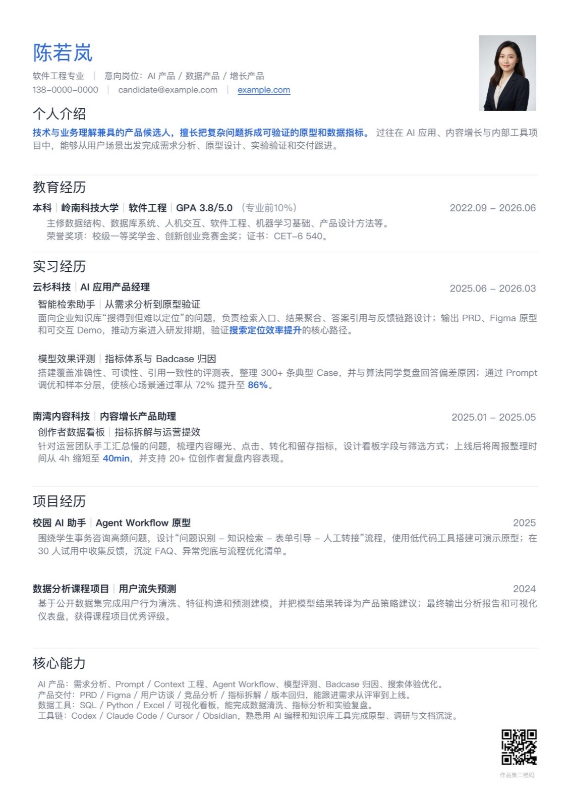<br><b>basic-a4</b><br><sub>经典单栏 · ATS 友好</sub></td>
<td align="center">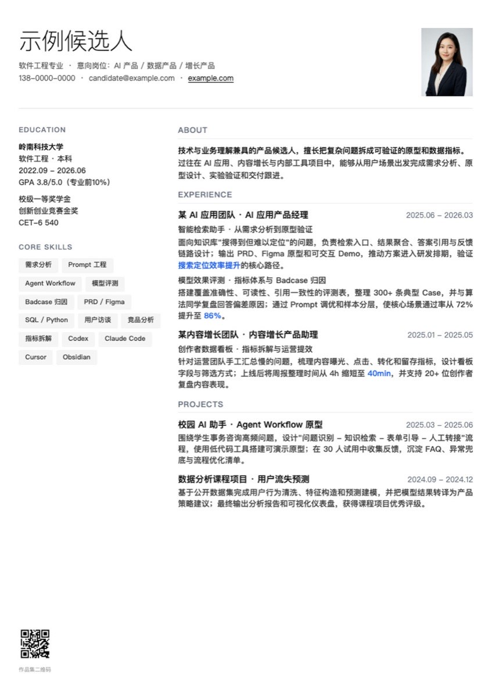<br><b>editorial</b><br><sub>双栏 Grid · 字重层级</sub></td>
<td align="center"><br><b>sidebar-compact</b><br><sub>深色侧栏 · 高辨识度</sub></td>
<td align="center">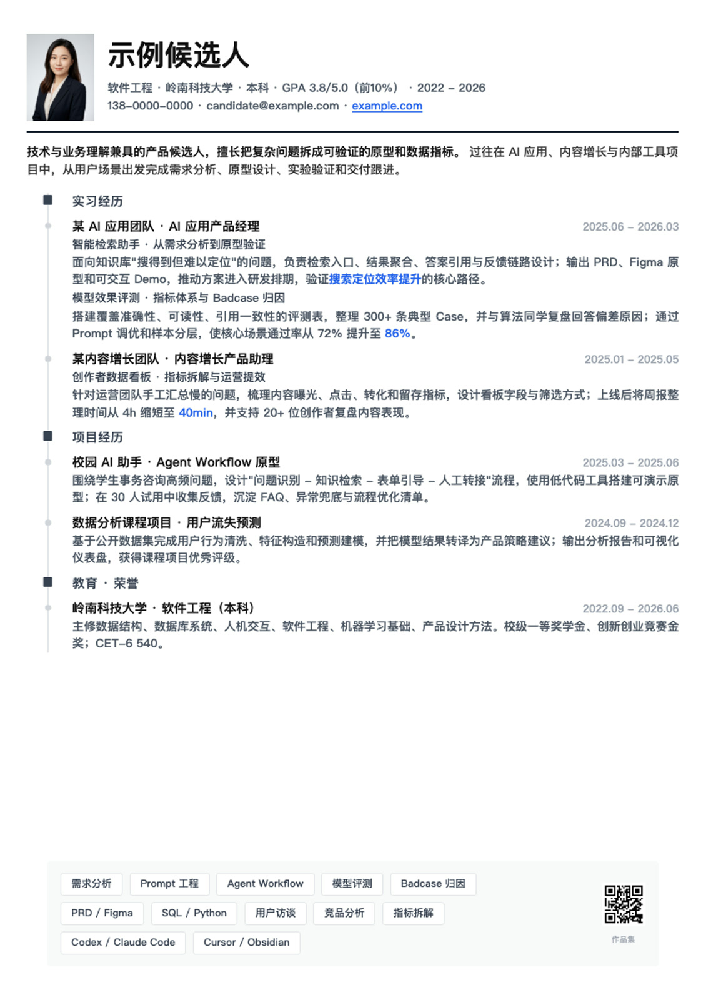<br><b>timeline-grid</b><br><sub>时间轴 · 成长叙事</sub></td>
</tr>
<tr>
<td align="center">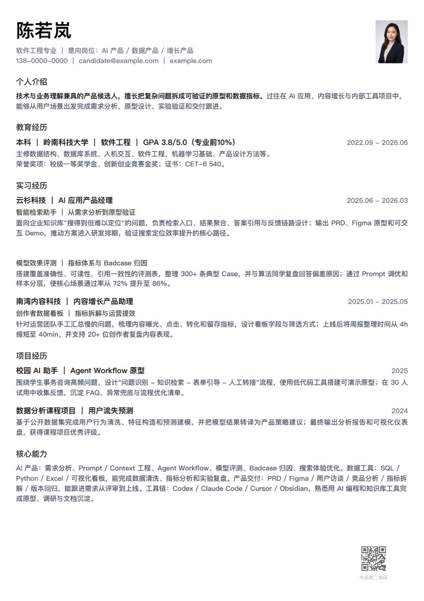<br><b>minimal-prose</b><br><sub>Stripe 极简 · 留白即设计</sub></td>
<td align="center">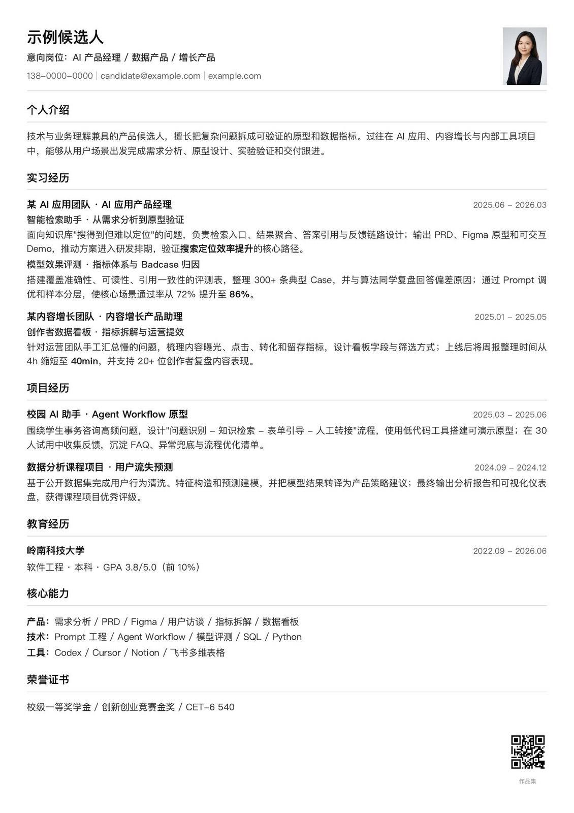<br><b>corporate-classic</b><br><sub>外企极简 · 纯黑白 · 内容为王</sub></td>
<td align="center">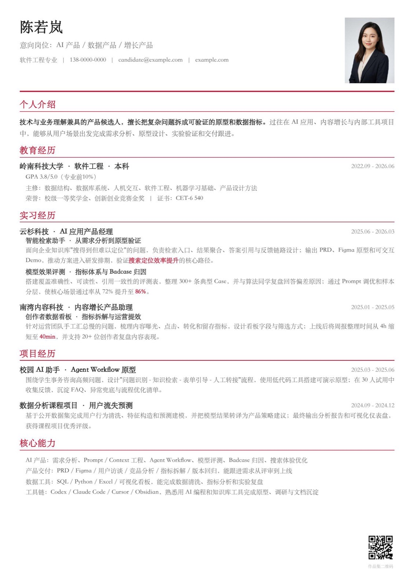<br><b>gov-red</b><br><sub>党政风 · 庄重规范</sub></td>
<td></td>
</tr>
</table>

### 个性系

个人觉得好玩的方向——设计语言完整、概念自洽，适合想表达点什么的人。

<table>
<tr>
<td align="center">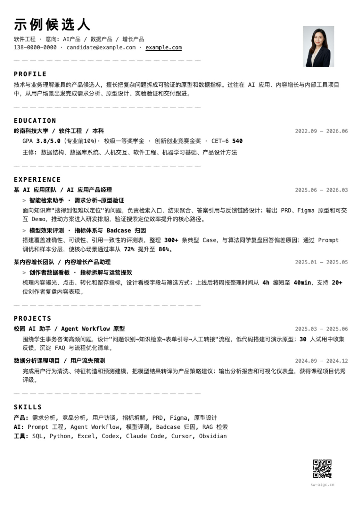<br><b>mono-raw</b><br><sub>Brutalist · 工具即美学</sub></td>
<td align="center">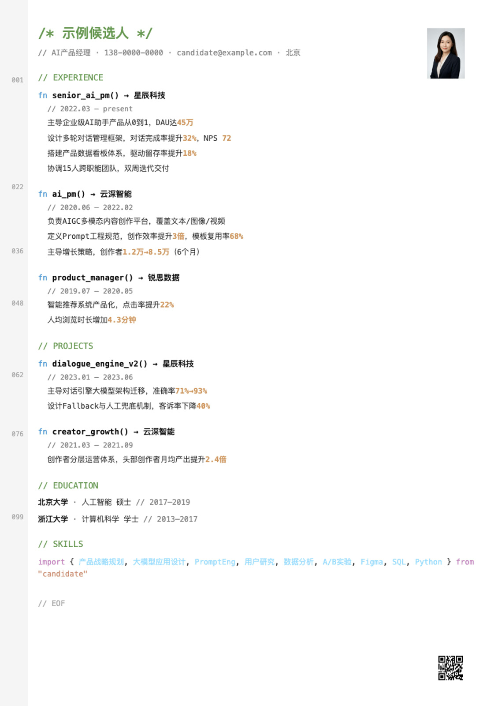<br><b>code-poetry</b><br><sub>源代码隐喻 · 极客风</sub></td>
<td align="center">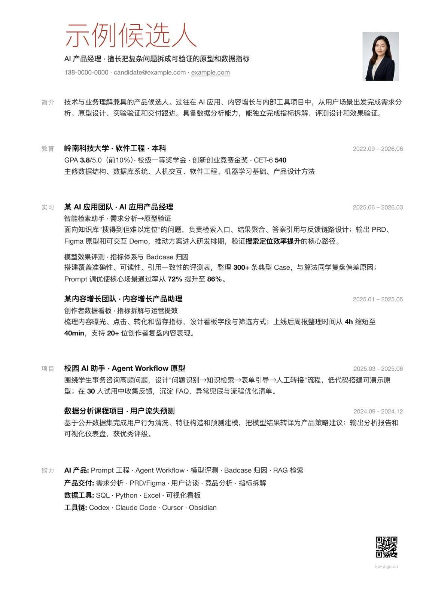<br><b>swiss-neue</b><br><sub>瑞士主义 · 隐形网格</sub></td>
<td align="center">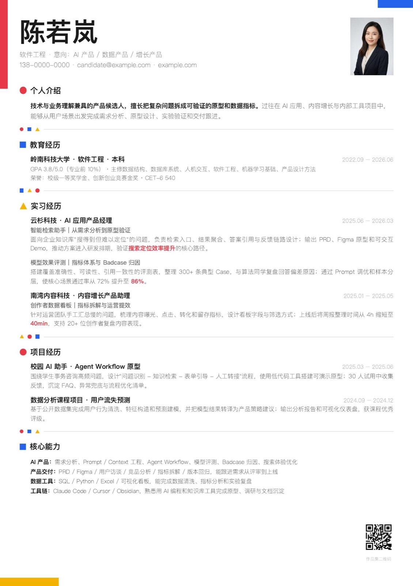<br><b>bauhaus</b><br><sub>包豪斯几何 · 三原色点缀</sub></td>
</tr>
</table>

每套模板都有完整的设计语言：加粗=层级、高亮=成果、浅色=辅助、间距=呼吸。不是随便配色就叫“模板”。

---

## 🚀 安装与使用

### 方式一:让 AI 帮你安装(最简单)

直接把这个链接丢给你的 AI 编程助手:

```
https://github.com/KevinYoung-Kw/vibe-resume-skill
```

然后说:

> "帮我安装这个 Skill,然后用它帮我写简历"

AI 会自动 clone 并放到正确的 skills 目录下。

### 方式二:手动安装

根据你使用的 AI 工具,复制到对应目录:

```bash
# Clone
git clone https://github.com/KevinYoung-Kw/vibe-resume-skill.git

# Claude Code / Cola
cp -r vibe-resume-skill ~/.agents/skills/vibe-resume-skill

# Codex CLI
cp -r vibe-resume-skill ~/.codex/skills/vibe-resume-skill

# Cursor(放到项目根目录的 .cursor/skills/ 下)
cp -r vibe-resume-skill .cursor/skills/vibe-resume-skill
```

安装后对 AI 说任何关于简历的事即可触发。

### 方式三:直接用模板(不装 Skill)

```bash
open assets/templates/swiss-neue/resume.html
# 编辑内容 → Ctrl+P → 打印为 PDF
```

---

## 🛡️ AI 内置硬约束

SKILL.md 里写了一套 **Layout Hard Constraints**,AI 生成时自动遵守:

- ✅ 页边距 ≤ 10mm - 内容占满页面,不允许两边空旷
- ✅ 密度自适应 - 内容少则字号行高自动放大;内容多则间距收紧
- ✅ 底部空白 ≤ 15% - 超过即 QA 失败,必须调整
- ✅ 头像零装饰 - 无边框、无圆角、无阴影、保持原色
- ✅ QR 不遮挡 - 二维码必须 100% 可见

**结果:无论谁用,出来的排版质量是稳定的。**

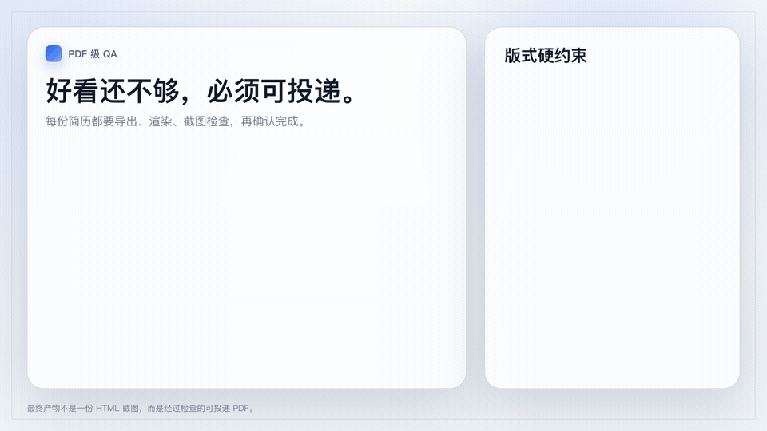

---

## 🎨 设计哲学

> 设计感在骨架里,不在皮肤上。

- **结构即设计** - 排版逻辑本身就是视觉表达
- **字重是层级系统** - 700 / 600 / 450 / 400,四级够用
- **高亮是语义标记** - 蓝色 = 核心成果,不是装饰
- **间距是呼吸节奏** - section / entry / line 三层韵律
- **克制胜过张扬** - 留白说的话比色块响亮

---

## 📁 结构

```
vibe-resume-skill/
├── SKILL.md              # AI 指令文件(核心)
├── assets/
│   ├── templates/        # 11 套模板 HTML(结构骨架)
│   └── previews/         # 预览图
├── references/           # 设计规范 & QA 清单
└── scripts/              # 导出 & 质量检测自动化
```

---

## 🤝 Contributing

欢迎提交新模板方向。请遵循 `references/template-expansion.md` 中的准入流程--新模板必须通过全页截图 QA 和与 baseline 的对比审查。

---

## 📄 License

CC BY-NC 4.0 - 个人使用随意,商用请联系作者。

---

<p align="center">
  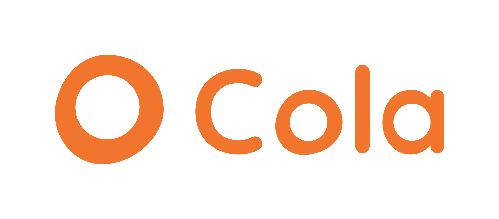
</p>

<p align="center">
  <b>水的离子积 × <a href="https://colaos.ai">Cola</a></b><br>
  <sub>Powered by Cola - AI that vibes with you.</sub>
</p>

<p align="center">
  <br>
  <sub>关注公众号「水的实践说」获取更多 AI 实践内容</sub>
</p>
