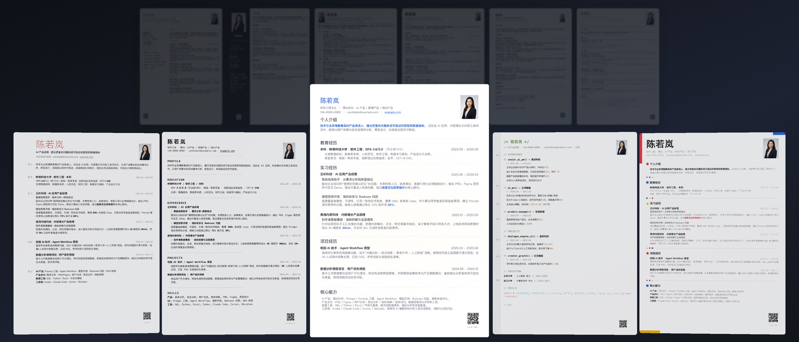

# vibe-resume-skill

让 Coding Agent 直接生成、修改和验证可投递的一页简历。

[](https://github.com/KevinYoung-Kw/vibe-resume-skill/stargazers)
[](LICENSE)
[](assets/templates/basic-a4/resume.html)
[](SKILL.md)

`vibe-resume-skill` 是一套给 Codex、Claude Code、Cursor 等 Coding Agent 使用的简历工作流。仓库包含 12 套 A4 HTML 模板、内容组织规则、PDF 导出脚本和版式 QA。模板本身没有前端运行时依赖，内容与样式都可以直接编辑。

它不是在线简历编辑器。使用时，把现有简历、项目材料和目标岗位交给 Agent；Agent 负责整理事实、改写文案、套用模板、导出 PDF，并根据截图继续调整。


## 工作方式

1. **提供材料**：现有简历、项目文档、作品集、岗位 JD、头像与二维码。
2. **选择模板**：从内置模板中选择一个版式，或让 Agent 根据岗位和内容密度推荐。
3. **导出与检查**：生成可编辑 HTML 和 PDF，检查页数、字体、留白、文本顺序、图片与敏感信息。

默认交付物：

- 一份可继续修改的 `resume.html`
- 一份可直接投递的 A4 PDF
- 一张用于视觉检查的全页截图
- 一次结构、字体、留白和敏感词 QA

## 快速开始

### 交给 Agent 安装

把仓库地址发给你的 Coding Agent：

```text
https://github.com/KevinYoung-Kw/vibe-resume-skill
```

然后说明目标，例如：

```text
安装这个 Skill，并使用 basic-a4 模板整理我的一页 AI 产品简历。
材料在 ./resume-materials，最终需要 HTML 和 PDF。
```

### 手动安装

```bash
git clone https://github.com/KevinYoung-Kw/vibe-resume-skill.git

# Claude Code / Cola
cp -r vibe-resume-skill ~/.agents/skills/vibe-resume-skill

# Codex CLI
cp -r vibe-resume-skill ~/.codex/skills/vibe-resume-skill

# Cursor
cp -r vibe-resume-skill .cursor/skills/vibe-resume-skill
```

### 直接使用模板

```bash
open assets/templates/basic-a4/resume.html
```

HTML 可以直接在浏览器中预览，也可以通过浏览器打印为 PDF。

## 模板

### 实用系

优先考虑招聘阅读顺序、信息密度与正式投递场景。

<table>
<tr>
<td align="center"><br><b>basic-a4</b><br><sub>经典单栏 · ATS 友好</sub></td>
<td align="center"><br><b>editorial</b><br><sub>双栏 Grid · 字重层级</sub></td>
<td align="center"><br><b>sidebar-compact</b><br><sub>深色侧栏 · 高辨识度</sub></td>
<td align="center"><br><b>timeline-grid</b><br><sub>时间轴 · 成长叙事</sub></td>
</tr>
<tr>
<td align="center"><br><b>minimal-prose</b><br><sub>克制单栏 · 留白舒展</sub></td>
<td align="center"><br><b>corporate-classic</b><br><sub>外企经典 · 内容优先</sub></td>
<td align="center"><br><b>gov-red</b><br><sub>党政风 · 庄重规范</sub></td>
<td align="center"><br><b>folio-ledger</b><br><sub>年报档案 · 编号索引</sub></td>
</tr>
</table>

### 个性系

保留完整的设计语言，适合技术、设计与创意岗位。

<table>
<tr>
<td align="center"><br><b>mono-raw</b><br><sub>Brutalist · 等宽排版</sub></td>
<td align="center"><br><b>code-poetry</b><br><sub>源代码隐喻 · 极客风</sub></td>
<td align="center"><br><b>swiss-neue</b><br><sub>瑞士主义 · 隐形网格</sub></td>
<td align="center"><br><b>bauhaus</b><br><sub>包豪斯几何 · 三原色点缀</sub></td>
</tr>
</table>

模板不是简单换色。每套模板都有独立的信息结构、字号层级、间距节奏与适用场景。新模板只有在全页截图质量不低于 `basic-a4` 时才会准入。

## 版式约束

Skill 默认执行以下规则：

- A4 竖版，优先控制在一页
- 正文字号不低于 9pt
- 主要内容底部留白不超过页面高度的 15%
- 头像保持原色，不添加边框、圆角、阴影或滤镜
- 二维码不得被文字、标签或装饰遮挡
- 实习内容留在实习经历，项目内容留在项目经历
- 不编造指标，不暴露内部链接、群聊、提交记录或其他敏感信息

这些规则写在 [`SKILL.md`](SKILL.md) 和 [`references/`](references/) 中。模板允许根据内容量调整字号、行高和段落间距，但不能破坏原有结构。

## 导出与 QA

创建模板工作区：

```bash
python3 scripts/create_workspace.py \
  --template basic-a4 \
  --output ./resume-workspace
```

导出 PDF 并运行检查：

```bash
python3 scripts/export_and_qa.py \
  ./resume-workspace/resume.html \
  --pdf ./resume-workspace/resume.pdf \
  --strict-final
```

QA 会检查：

- PDF 是否为单页 A4
- 预期字体是否正确嵌入
- `pdftotext` 提取顺序是否合理
- 底部留白是否超过 15%
- 是否残留模板占位内容或敏感词
- 是否成功生成全页截图

运行完整 QA 需要 Chrome/Chromium 与 Poppler（`pdfinfo`、`pdffonts`、`pdftotext`、`pdftoppm`）。


## 项目结构

```text
vibe-resume-skill/
├── SKILL.md              # Agent 工作流与硬约束
├── assets/
│   ├── templates/        # 12 套 HTML 模板
│   ├── previews/         # 模板预览
│   └── demos/            # README 演示动图
├── references/           # 模板契约、扩展协议与 QA 清单
└── scripts/              # 工作区创建、PDF 导出与候选模板审阅
```

## 扩展模板

新增模板前请阅读 [`references/template-expansion.md`](references/template-expansion.md)。基本流程是：

1. 在仓库外的隔离目录完成设计与实现。
2. 使用与 `basic-a4` 相同的虚构内容进行公平比稿。
3. 导出 HTML、PDF 和全页截图，运行格式 QA。
4. 由主 Agent 对照基准模板审核。
5. 经用户确认后，才移动到 `assets/templates/`。

只修改配色、字体或装饰，不构成新的模板方向。

## Star History

[](https://www.star-history.com/?repos=KevinYoung-Kw%2Fvibe-resume-skill&type=date&legend=top-left)

## Contributing

欢迎提交问题、文档修正和模板建议。涉及新模板的 Pull Request 需要附带：

- 模板 HTML 与必要资源
- 全页预览图
- 一页 A4、字体、文本顺序和底部留白 QA 结果
- 与 `basic-a4` 的并排比较

## License

[CC BY-NC 4.0](LICENSE)。个人与非商业用途可按许可证使用；商业使用请联系作者。

---

<p align="center">
  
</p>

<p align="center">
  <b>水的离子积 × <a href="https://colaos.ai">Cola</a></b><br>
  <sub>Powered by Cola</sub>
</p>

<p align="center">
  <br>
  <sub>关注公众号「水的实践说」获取更多 AI 实践内容</sub>
</p>
